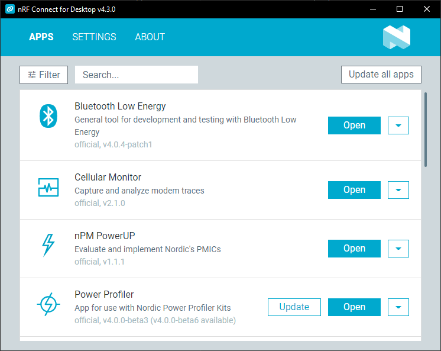

# Download and overview

Download nRF Connect for Desktop from Nordic Semiconductor's [website](https://www.nordicsemi.com/Software-and-Tools/Development-Tools/nRF-Connect-for-desktop).

!!! note "Note"
      On macOS and Linux, you must download and install the [SEGGER J-Link Software](https://www.segger.com/downloads/jlink/#J-LinkSoftwareAndDocumentationPack) separately.

After installing and starting the main application, you see an overview of available apps.

For information how to install the apps, see [Installing and updating nRF Connect for Desktop apps](installing_apps.md).

For each of the applications, you have the following options available from the arrow-down drop-down menu:

- **More info** - Opens the repository of the app on GitHub.
- **Release notes** - Opens the changelog of the app on GitHub.
- **Install other version** - Lets you [install](installing_apps.md) an earlier version of the app.

Other options, such as [Create a shortcut](./installing_apps.md#creating-shortcut-to-the-app), become available after you install the application.
