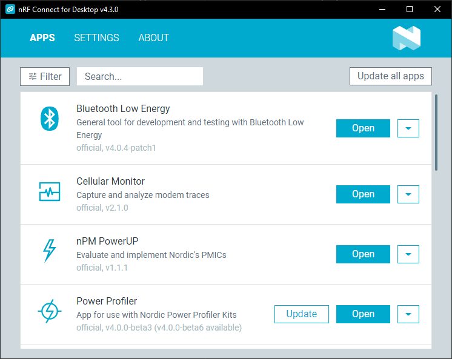

# Installing apps in nRF Connect for Desktop

All applications available from nRF Connect for Desktop share the same installation instructions.

## Installation requirements

Before you can install any of the apps, [download and install](download_cfd.md) nRF Connect for Desktop (version 4.1 or later).

!!! info "Tip"

    You can enable the use of Nordic Semiconductor's https://files.nordicsemi.cn/ for installing and updating nRF Connect for Desktop and its apps.
    This server has a better connection in the People's Republic of China.
    Go to the [Settings tab](overview_cfd.md#mainland-china-app-server) in nRF Connect for Desktop to enable this option.

## Installing an app

To install any of the apps in nRF Connect for Desktop:

1. Open nRF Connect for Desktop.
2. Find the app on the list.
3. Use one of the following options:

    * **Recommended:** Click **Install** to install the latest version of the app.
    * Click the arrow-down button and select **Install other version**. A notification appears where you can select the app version to install.

        !!! note "Note"
             Nordic Semiconductor only supports the latest version of each app.

Once the app is installed, you can launch it by clicking **Open**.

After you install the app, [additional options](overview_cfd.md#post-installation-options) become available in the launcher UI.
