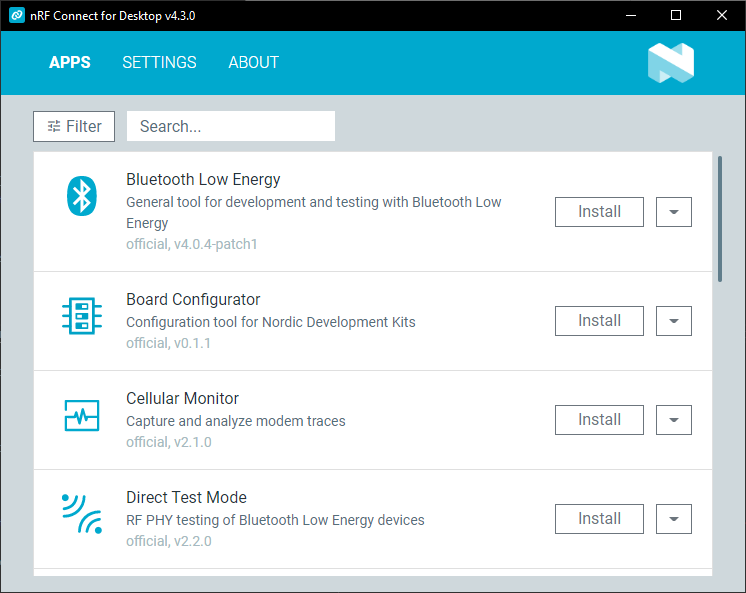

# Launcher overview

After [installing and starting the launcher](download_cfd.md), you see the list of apps available for installation.

For information how to install the apps, see [Installing and updating nRF Connect for Desktop apps](installing_apps.md).

## Apps tab

The **Apps** tab lists all available applications and lets you manage their installations.

### Filter

You can use the **Filter** menu to list applications by their sources and state.

### Search

Type input into the field to perform a fuzzy live search of the application list.

### Drop-down menu options

For each of the applications, you have the following options available from the arrow-down drop-down menu:

- **More info** - Opens the repository of the app on GitHub.
- **Release notes** - Opens the changelog of the app on GitHub.
- **Install other version** - Lets you [install](installing_apps.md) an earlier version of the app.

### Post-installation options

After you install the application, several new options become available.

#### Updating the apps

If a new version of the app becomes available, an **Update** button is displayed next to the **Open** button. Click this button to install the latest version.

You can also select whether you want the launcher to check for updates at the startup. You can do this in the **Settings** tab.

#### Uninstalling the apps

To uninstall the app, click the arrow-down button and select **Uninstall**.

#### Creating shortcut to the app

For easy access, you can create a desktop shortcut by clicking the arrow-down button and selecting **Create shortcut**.

## Settings tab

The **Settings** tab lets you customize how the launcher works and where it pulls information about the apps.

### Updates

Here you can check for updates to both the launcher and the nRF Connect for Desktop apps you have installed.

### App sources

Use the **Add source** button to provide URL to a custom list of application.
This can be used for example to share early versions of applications under development.

For some of these sources, you might need to request an identity token and add it in [Authentication](#authentication).

### Authentication

Here you can manage your identity token, which allows you to access non-external sources from Nordic Semiconductor. The token is required for accessing certain proprietary or early-access applications.

For detailed information about working with authentication tokens, see [Working with authentication tokens](working_with_authentications_tokens.md).

### Mainland China app server

This section allows you to enable the use of a dedicated server for better connectivity in the People's Republic of China. When enabled, the launcher will use https://files.nordicsemi.cn/ to download publicly available apps, which provides improved connection speeds within mainland China.

### Usage statistics

Here you can enable sharing of anonymized usage data with Nordic Semiconductor to help improve nRF Connect for Desktop applications.
Click **Show agreement** to see what kind of data is collected.

## About tab

Here you can view application information, access this documentation, and check the license.
