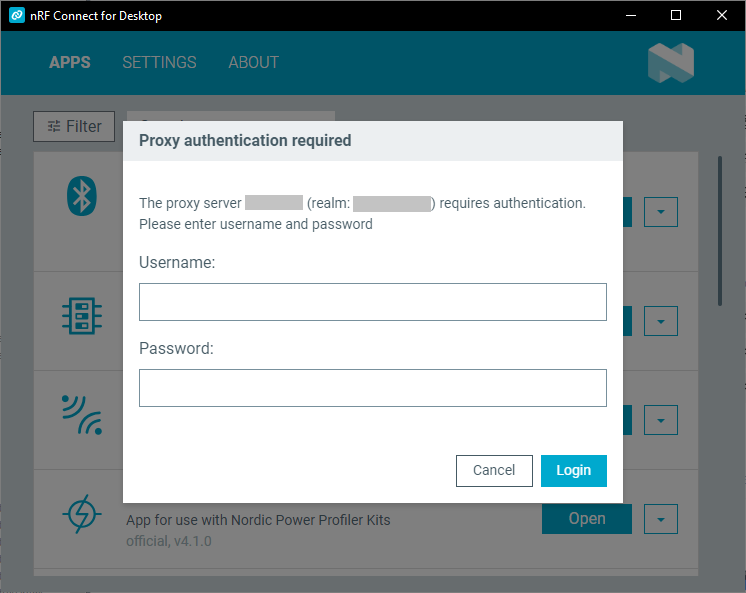

# Starting nRF Connect for Desktop with proxy settings

You can run nRF Connect for Desktop with custom proxy network settings if your network or OS policy requires them to access the application.

nRF Connect for Desktop has the same proxy support as [Google Chromium](https://www.chromium.org/developers/design-documents/network-settings),
and should in most cases pick up the proxy settings configured in the underlying OS. However, in some cases you may need to add some extra configuration, as
described below.

## Available proxy settings

You can run nRF Connect for Desktop with the following proxy setting configuration:

| Proxy setting flag    | Description | Parameters  |
|-----------------------|-------------|-------------|
| `--no-proxy-server`   | Do not use proxy. This overrides any other proxy settings provided. | None  |
| `--proxy-server`      | Use a custom proxy configuration. | `<uri>[:<port>]` - A single URI with optional port to use for all URLs. |
| `--proxy-pac-url`     | Use a custom PAC address. | `<pac-file-url>` - The URL of the PAC to use. |
| `--proxy-bypass-list` | Disable the specified proxy for the given list of hosts. The flag must be used with `--proxy-server`. | `(<trailing_domain>|<ip-address>)[:<port>][;...]` - A shortened URL of the domain or the IP address, together with the the port to use for the URL or IP address. Providing the port is optional. |

## Specifying custom proxy settings

To specify custom proxy settings, complete the following steps:

1. Go to the directory that contains the nRF Connect for Desktop executable file.
1. Open a command line terminal.
1. Run the executable with the proxy settings of your choice.</br>
   For example, on Windows, the following command starts nRF Connect for Desktop with the port `8000` of the `random_server` proxy used for all traffic:

   ```shell
   "nRF_Connect_for_Desktop.exe" --proxy-server="random_server:8000"
   ```

## Logging to authenticated proxies

If the proxy server you want to use requires authentication, nRF Connect for Desktop will show a login dialog for each network request:



By default, nRF Connect for Desktop checks for updates at startup, which will trigger this dialog.
You can turn off automatic checking for updates at startup in the [Settings](overview_cfd.md#settings-tab) tab.
