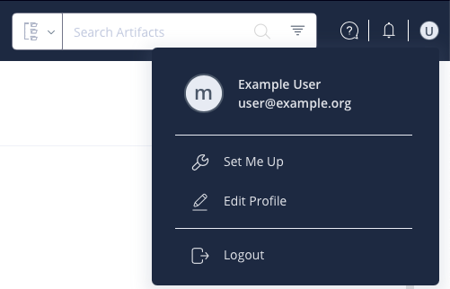

# Working with identity tokens

Identity tokens in nRF Connect for Desktop are used to verify your access rights to restricted Nordic Semiconductor [app sources](overview_cfd.md#app-sources). These tokens are required for accessing certain proprietary or early-access applications that are not publicly available.

## Generating a new token

Complete the following steps:

1. Log in to the [Nordic Semiconductor JFrog portal](https://files.nordicsemi.com/) using the account set up by Nordic Semiconductor. 
   If you are a company employee, you can log in directly. Otherwise, you need to ask your Nordic contact for an account, for example on [DevZone](https://devzone.nordicsemi.com/).
2. In **User Menu**, click **Edit Profile**. 
   The **User Profile** page opens.

    

3. Click **Generate an Identity Token**.
4. Optionally, add description to identify the token later on.
5. Copy the token from the **Reference Token** field. 
   This token will be used in the step 3 of the [Setting a token](#setting-a-token) procedure below.

## Setting a token

Complete the following steps:

1. On Linux and macOS, allow nRF Connect for Desktop to access your safe storage location. 
   This is the location where the token is kept encrypted. For more information, see [safeStorage](https://www.electronjs.org/docs/latest/api/safe-storage) in the Electron documentation.
2. In nRF Connect for Desktop, go to the **Settings** tab.
3. In the **Authentication** section, click **Set token**.
4. Paste your token in the dialog box. 
   This is the token you got in the [Generating a new token](#generating-a-new-token) procedure.
5. Click **Set**.

Once set, your authentication information will be displayed in the **Authentication** section:

!!! info "Tip"
      Make sure that you also have an [app source](./overview_cfd.md#app-sources) added to see the restricted app versions and [filter them](overview_cfd.md#filter).

## Replacing a token

If you need to update your token, for example when your current token is about to expire, complete the following steps:

1. [Generate a new token](#generating-a-new-token).
2. Go to the **Settings** tab.
3. In the **Authentication** section, click **Replace token**.
4. Paste your new token in the dialog box.
5. Click **Replace**.

The current token will be replaced with the new one.

## Removing a token

Complete the following steps:

1. Go to the **Settings** tab.
2. In the **Authentication** section, click **Remove**.
3. Review the warning message.
4. Click **Remove token** to confirm.

### Important considerations when removing a token

When you remove an identity token:

- You will no longer be able to add restricted app sources from Nordic Semiconductor.
- If you have existing restricted app sources added, updating these sources will lead to errors.
- You will be unable to install apps from restricted app sources.

## Troubleshooting

If you encounter errors when accessing restricted app sources, check the following points:

* Token is valid and has not expired.
* You have an active internet connection.
* You have the correct permissions to access the specific resources.

If problems persist, you may need to generate a new token or contact your Nordic Semiconductor representative for assistance.
