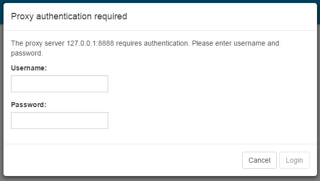

# Proxy settings for nRF Connect for Desktop

nRF Connect for Desktop has the same proxy support as [Google Chromium](https://www.chromium.org/developers/design-documents/network-settings), and should in most cases pick up the proxy settings configured in the underlying OS. However, in some cases you may need to add some extra configuration, as described below.

## Custom proxy settings

Custom proxy settings can be specified by starting nRF Connect for Desktop with the following command line flags:

```
# Disable proxy
--no-proxy-server

# Manual proxy address
--proxy-server=<scheme>=<uri>[:<port>][;...] | <uri>[:<port>] | "direct://"

# Manual PAC address
--proxy-pac-url=<pac-file-url>

# Disable proxy per host
--proxy-bypass-list=(<trailing_domain>|<ip-address>)[:<port>][;...]
```

## Authenticated proxies

If a proxy server requires authentication, nRF Connect for Desktop will show a login dialog for each network request:



By default, nRF Connect for Desktop checks for updates at startup, which will lead to this dialog popping up. Checking for updates at startup can be turned off in Settings.
