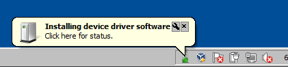
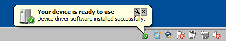

# Troubleshooting LIBUSB_* errors on win32 platforms

nRF Connect for Desktop uses [libusb](https://libusb.info/) and [node-usb](https://github.com/tessel/node-usb) to know how many USB-capable Nordic SoCs (e.g. nRF52840) are connected to your PC, and also to set them into DFU mode when they need to be re-programmed by an nRF Connect for Desktop application.

While this makes it easier to develop nRF Connect for Desktop applications, it might also cause some errors to show up in some win32 environments. This document collects the known causes and workarounds for these errors.

# Scenarios where these errors happen

## Connecting a USB device into Windows 7 for the first time

A `LIBUSB_ERROR_NOT_FOUND` error shows up when connecting an nRF USB device into a Windows 7 computer for the first time. In particular, this sequence of actions (in this exact order) reproduces this scenario:

- Run the nRF Connect for Desktop installer.
  - This includes the *rules* for the right drivers, but not the actual link between a USB device and its driver.
- Launch an nRF Connect for Desktop application.
- Plug an nRF52840 device into a USB port.
- Let Windows 7 attach the right drivers.
  - This uses the *rules* already installed for actually *binding* a driver to the newly-connected nRF USB device.
  - A yellow bubble appears from the system tray, indicating driver installation, like this:
  

- A `LIBUSB_ERROR_NOT_FOUND` is shown on the log of the nRF Connect for Desktop application.
- After a time (that varies between a few seconds and a couple of minutes), Windows 7 finishes binding the libusb driver to the nRF USB device.
  - A yellow bubble appears from the system tray, indicating drivers are ready, like this:
  

Please note that a USB device is "new" for Windows if the combination of its USB vendor ID, product ID, revision, and serial number have never been seen before. In other words: changing the firmware in an nRF device, or setting it into bootloader mode will make it appear as "new" for Windows.

Therefore, this error might happen the first time that an nRF USB device is connected, the first time it enters bootloader mode, and the first time it is loaded with application-specific USB-capable firmware.

#### Workaround

- Close all programs and processes that might be using nRF USB devices (including nRF Connect for Desktop).
- Connect the nRF USB device(s).
- **Wait** until Windows 7 has finished binding the right drivers to the USB device(s).
- Launch nRF Connect for Desktop.

If the nRF USB device enters bootloader mode for the first time, or is loaded with new firmware, you may need to repeat this workaround.

## USB devices without an expected interface

A `LIBUSB_ERROR_NOT_FOUND` error shows up when connecting an nRF USB device **without** a DFU trigger interface.

In order to check if this is also your scenario, launch the Windows Device Manager, set the view to "Devices by Connection", and find the part of the USB device tree with the nRF USB Device (usually under ACPI computer → PCI bus → USB root hub).

The nRF USB device shall appear as a "USB Composite Device" and, beneath that, each USB interface appears as a device in the tree. nRF Connect for Desktop *expects* a "nRF Connect DFU trigger" interface to be present, like so:

The "nRF Connect DFU trigger" interface is implemented by the [Nordic USB DFU trigger library](http://infocenter.nordicsemi.com/topic/com.nordic.infocenter.sdk5.v15.0.0/group__nrf__dfu__trigger__usb.html). This scenario happens when the firmware loaded in the nRF USB device does not use (or misuses) this USB DFU library.

#### Workaround

Most nRF Connect for Desktop applications will automatically load the nRF USB device with firmware known to work.

- For nRF52840 dongles:
  - Press the reset button. The red LED should be pulsing, indicating the nRF device is in DFU bootloader mode.
  - Launch an nRF Connect for Desktop application (for example, the RSSI viewer).
  - Make the nRF Connect for Desktop application use the nRF USB device in bootloader mode. nRF Connect for Desktop will perform a DFU operation, programming the nRF device with firmware known to work.

- For nRF52840 development kits:
  - Unplug the devkit's USB connector marked "nRF USB", and connect a USB cable to the USB connector for the [Interface MCU](http://infocenter.nordicsemi.com/topic/com.nordic.infocenter.nrf52/dita/nrf52/development/nrf52840_pdk/if_mcu.html)
  - Use nRF Connect for Desktop Programmer to program it with firmware known to work.

Please note that it's safe to ignore this error **only** when **all** of the following are true:

- You are developing firmware for nRF devices using the [USBD library](http://infocenter.nordicsemi.com/topic/com.nordic.infocenter.sdk5.v15.0.0/group__app__usbd.html?cp=4_0_0_6_11_58), **and**
- You are using the Nordic Semiconductor USB Vendor ID (and a USB Product ID reserved for development), **and**
- You are **not** using the [Nordic USB DFU trigger library](http://infocenter.nordicsemi.com/topic/com.nordic.infocenter.sdk5.v15.0.0/group__nrf__dfu__trigger__usb.html) **on purpose**.
